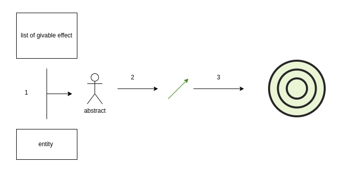

# Effect system
The effect system is one of the most important system of the project.  
It used to handle every shoot related code and effect obtainable by player. 

## how effect work
The effect is made a list of functions use as hook call by other entity [for more information, look at abstract effect](<abstract effect.md>).

>#### Exemple :
> ```gdscript
># [bullet.gd]()
>func _process(delta):
>	for effect in effects :
>		effect.moveBullet(speed* delta,self)
>```
> the bullet script the call every movebullet() of his effects
>```gdscript
># MoveNormal.gd
>func moveBullet(speed:float,bullet:Bullet):
>	bullet.position += Vector2.UP.rotated(bullet.rotation) * speed
>
>```
> the moveNormal effect move the bullet forward  

This way, a script can be easily replaced/Added and will change this behavior.

## Effect entity
effect are use by two class : abstract entity and bullet
### [Abstract entity](<abstract effect.md>) 
This is an abstract class use by [alien](<base alien.md>) and [player](../other/player.md) and offer some utils function and variable to be modified more easily by effect.
### [bullet](../other/bullet.md)
The bullet is his own effects hook (like moveBullet()).

## effect lifecycle


0. The effect is set in the entity or listed in the list of givable item and added in the [effect menu](<../menu/effect menu.md>).
1. The effect is given to an entity in the entity code or in the effect menu.
2. *Some* effects apply itself the bullet (ex: effect to move the bullet).
3. *Some* effect also applies itself to the enemy (ex : burning effect).

### user vs system effect
If you look at the code structure you can see three folders in the effect folders; one is for object load by effect and the others are for 2 type of script.
- **player effect** : Effect give by the player. They're listed in the `listOfGivableItem.gd` class so the game know with effect to choose from.

- **system effect** : Default effect set using the `addEffets()` in the ready() of an extended [AbstractEffectEntity](<abstract effect entity.md>)
